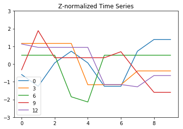
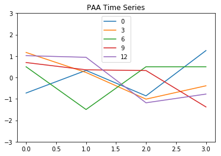
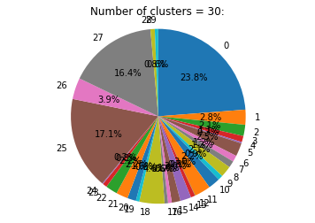

# Stock Market Co-movement Pre-clustering

## Dataset Information:
The dataset is obtained from Free88.org: http://free88.org/klse.html

This is a reformatted dataset which includes the end of day (EOD) stock market data from 26 April to 15 May 2018, from KLSE website on every weekday basis at 6:30pm.

## Attribute Information
1) NAME: Stock name.

2) TICKER: Stock abbreviation.

3) PER: Period (D means per day).

4) DATE: Date (e.g. 20180426).

5) OPEN: Opening price of the day.

6) HIGH: Highest price of the day.

7) LOW: Lowest price of the day.

8) CLOSE: Closing price of the day.

9) VOL: Volume of the day.

10) OPENINT: Open interest of the day.

## Analysis Objective
To group the stocks into different clusters through their daily closing price time series (using low-resolution pattern rather than original pattern) from 26 April to 15 May 2018.

## Data Preparation
All the modules that will be used in this notebook are loaded.


```python
import pandas as pd
import numpy as np
import matplotlib.pylab as plt
from saxpy.alphabet import cuts_for_asize
from saxpy.znorm import znorm
from saxpy.paa import paa
from saxpy.sax import ts_to_string
from kmodes.kmodes import KModes
```

### Load Data
Data is loaded and cleaned.


```python
# include the available stock market dates in list
list_date = ['20180426', '20180427', '20180430', '20180502', '20180503',
            '20180504', '20180507', '20180508', '20180514', '20180515']

list_datecol = []

cnt_concat = 0

for date in list_date:
    # read the datafile by date
    df_temp = pd.read_csv('../data/KLSE_%s.csv' % date)
    
    # remove rows with irrelevant date
    df_temp = df_temp[df_temp['DATE']==int(date)]
    
    # remove rows with null values in NAME and CLOSE attribute
    df_temp.dropna(axis=0, subset=['NAME', 'CLOSE'], inplace=True)
    
    # remove duplicate rows
    df_temp.drop_duplicates(inplace=True)
    
    # keep NAME and CLOSE (according date) attribute only
    df_temp = df_temp[['NAME', 'CLOSE']]
    val_datecol = 'CLS_%s' % date[-6:]
    df_temp.columns = ['NAME', val_datecol]
    list_datecol.append(val_datecol)
    
    # add new CLS (according new date) attribute
    if cnt_concat == 0:
        df_init = df_temp.copy()
    else:
        df_init = pd.concat([df_init, df_temp[val_datecol]], axis=1,
                            join='inner')
    cnt_concat += 1

# show first 5 rows
display(df_init[:5])

print('There\'re %d rows and %d attributes in dataframe.' % (df_init.shape))
```


<div>
<table border="1" class="df1">
  <thead>
    <tr style="text-align: right;">
      <th></th>
      <th>NAME</th>
      <th>CLS_180426</th>
      <th>CLS_180427</th>
      <th>CLS_180430</th>
      <th>CLS_180502</th>
      <th>CLS_180503</th>
      <th>CLS_180504</th>
      <th>CLS_180507</th>
      <th>CLS_180508</th>
      <th>CLS_180514</th>
      <th>CLS_180515</th>
    </tr>
  </thead>
  <tbody>
    <tr>
      <th>0</th>
      <td>NEGRI SEMBILAN OIL PALMS BERHAD (2038)</td>
      <td>1.510</td>
      <td>1.500</td>
      <td>1.520</td>
      <td>1.530</td>
      <td>1.520</td>
      <td>1.500</td>
      <td>1.500</td>
      <td>1.530</td>
      <td>1.540</td>
      <td>1.540</td>
    </tr>
    <tr>
      <th>1</th>
      <td>A50CHIN-C12</td>
      <td>0.055</td>
      <td>0.050</td>
      <td>0.055</td>
      <td>0.040</td>
      <td>0.040</td>
      <td>0.035</td>
      <td>0.045</td>
      <td>0.050</td>
      <td>0.060</td>
      <td>0.060</td>
    </tr>
    <tr>
      <th>2</th>
      <td>ABF MALAYSIA BOND INDEX FUND</td>
      <td>1.153</td>
      <td>1.153</td>
      <td>1.153</td>
      <td>1.153</td>
      <td>1.153</td>
      <td>1.153</td>
      <td>1.155</td>
      <td>1.155</td>
      <td>1.155</td>
      <td>1.155</td>
    </tr>
    <tr>
      <th>3</th>
      <td>A50CHIN-C13</td>
      <td>0.300</td>
      <td>0.300</td>
      <td>0.300</td>
      <td>0.300</td>
      <td>0.210</td>
      <td>0.210</td>
      <td>0.210</td>
      <td>0.240</td>
      <td>0.240</td>
      <td>0.240</td>
    </tr>
    <tr>
      <th>4</th>
      <td>ABLEGROUP BERHAD (7086.KL)</td>
      <td>0.100</td>
      <td>0.100</td>
      <td>0.100</td>
      <td>0.100</td>
      <td>0.100</td>
      <td>0.100</td>
      <td>0.100</td>
      <td>0.100</td>
      <td>0.105</td>
      <td>0.105</td>
    </tr>
  </tbody>
</table>
</div>


    There're 1875 rows and 11 attributes in dataframe.
    

The following information about the attributes in dataframe are displayed:

1) Data type

2) Number of null values

3) Percentage of null values, with respect to the total number of rows


```python
# display the table with info of data type and null values for each attribute
tab_info = pd.DataFrame(df_init.dtypes).T.rename(index={0:'Data Type'})
tab_info = tab_info.append(pd.DataFrame(df_init.isnull().sum()).T
                           .rename(index={0:'Null Values (#)'}))
tab_info = tab_info.append(pd.DataFrame(df_init.isnull().sum()/
                                        df_init.shape[0]*100).T
                           .rename(index={0:'Null Values (%)'}))
display(tab_info)
```


<div>
<table border="1" class="df2">
  <thead>
    <tr style="text-align: right;">
      <th></th>
      <th>NAME</th>
      <th>CLS_180426</th>
      <th>CLS_180427</th>
      <th>CLS_180430</th>
      <th>CLS_180502</th>
      <th>CLS_180503</th>
      <th>CLS_180504</th>
      <th>CLS_180507</th>
      <th>CLS_180508</th>
      <th>CLS_180514</th>
      <th>CLS_180515</th>
    </tr>
  </thead>
  <tbody>
    <tr>
      <th>Data Type</th>
      <td>object</td>
      <td>float64</td>
      <td>float64</td>
      <td>float64</td>
      <td>float64</td>
      <td>float64</td>
      <td>float64</td>
      <td>float64</td>
      <td>float64</td>
      <td>float64</td>
      <td>float64</td>
    </tr>
    <tr>
      <th>Null Values (#)</th>
      <td>0</td>
      <td>0</td>
      <td>0</td>
      <td>0</td>
      <td>0</td>
      <td>0</td>
      <td>0</td>
      <td>0</td>
      <td>0</td>
      <td>0</td>
      <td>0</td>
    </tr>
    <tr>
      <th>Null Values (%)</th>
      <td>0</td>
      <td>0</td>
      <td>0</td>
      <td>0</td>
      <td>0</td>
      <td>0</td>
      <td>0</td>
      <td>0</td>
      <td>0</td>
      <td>0</td>
      <td>0</td>
    </tr>
  </tbody>
</table>
</div>


The dataframe is 100% filled with values for all attributes.

### Transform Data
The time series data is transformed from dataframe attribute to array form for the following pre-clustering analysis purpose.


```python
# create a dataframe with CLS related attributes in array form
df_final = pd.DataFrame({0:df_init['NAME'],
                         1:df_init.apply(lambda x:tuple(x[list_datecol]),
                                         axis=1)
                         .apply(np.array)}).rename(columns={0:'NAME',
                                                            1:'CLS_ALL'})

# show first 5 rows
display(df_final[:5])

print('There\'re %d rows and %d attributes in dataframe.' % (df_final.shape))
```


<div>
<table border="1" class="df3">
  <thead>
    <tr style="text-align: right;">
      <th></th>
      <th>NAME</th>
      <th>CLS_ALL</th>
    </tr>
  </thead>
  <tbody>
    <tr>
      <th>0</th>
      <td>NEGRI SEMBILAN OIL PALMS BERHAD (2038)</td>
      <td>[1.51, 1.5, 1.52, 1.53, 1.52, 1.5, 1.5, 1.53, ...</td>
    </tr>
    <tr>
      <th>1</th>
      <td>A50CHIN-C12</td>
      <td>[0.055, 0.05, 0.055, 0.04, 0.04, 0.035, 0.045,...</td>
    </tr>
    <tr>
      <th>2</th>
      <td>ABF MALAYSIA BOND INDEX FUND</td>
      <td>[1.153, 1.153, 1.153, 1.153, 1.153, 1.153, 1.1...</td>
    </tr>
    <tr>
      <th>3</th>
      <td>A50CHIN-C13</td>
      <td>[0.3, 0.3, 0.3, 0.3, 0.21, 0.21, 0.21, 0.24, 0...</td>
    </tr>
    <tr>
      <th>4</th>
      <td>ABLEGROUP BERHAD (7086.KL)</td>
      <td>[0.1, 0.1, 0.1, 0.1, 0.1, 0.1, 0.1, 0.1, 0.105...</td>
    </tr>
  </tbody>
</table>
</div>


    There're 1875 rows and 2 attributes in dataframe.
    

## Stock Pre-clustering
### Reduce Dimensionality
The data is now ready for pre-clustering analysis purpose. The content of CLS_ALL attribute is used as the input of time series data to be reduced its dimensionality further.


```python
# Z-normalization of all time series
df_final['ZNORM'] = df_final['CLS_ALL'].apply(lambda x:znorm(x))

# Piecewise Aggregate Approximation (PAA) to 4 points
cnt_PAA = 4
df_final['PAA_%d' % cnt_PAA] = df_final['ZNORM'].apply(
    lambda x:paa(x, cnt_PAA))

# Symbolic Aggregate Approximation (SAX) with 3 word sizes (e.g. abc)
cnt_SAX = 3
df_final['SAX_%d' % cnt_SAX] = df_final['PAA_%d' % cnt_PAA].apply(
    lambda x:ts_to_string(x, cuts_for_asize(cnt_SAX)))

# show first 5 rows
display(df_final[:5])

print('There\'re %d rows and %d attributes in dataframe.' % (df_final.shape))
```


<div>
<table border="1" class="df4">
  <thead>
    <tr style="text-align: right;">
      <th></th>
      <th>NAME</th>
      <th>CLS_ALL</th>
      <th>ZNORM</th>
      <th>PAA_4</th>
      <th>SAX_3</th>
    </tr>
  </thead>
  <tbody>
    <tr>
      <th>0</th>
      <td>NEGRI SEMBILAN OIL PALMS BERHAD (2038)</td>
      <td>[1.51, 1.5, 1.52, 1.53, 1.52, 1.5, 1.5, 1.53, ...</td>
      <td>[-0.5947367404095588, -1.2555553408646485, 0.0...</td>
      <td>[-0.7269004605005767, 0.33040930022756687, -0....</td>
      <td>abac</td>
    </tr>
    <tr>
      <th>1</th>
      <td>A50CHIN-C12</td>
      <td>[0.055, 0.05, 0.055, 0.04, 0.04, 0.035, 0.045,...</td>
      <td>[0.055, 0.05, 0.055, 0.04, 0.04, 0.035, 0.045,...</td>
      <td>[0.053000000000000005, 0.043, 0.04199999999999...</td>
      <td>bbbb</td>
    </tr>
    <tr>
      <th>2</th>
      <td>ABF MALAYSIA BOND INDEX FUND</td>
      <td>[1.153, 1.153, 1.153, 1.153, 1.153, 1.153, 1.1...</td>
      <td>[1.153, 1.153, 1.153, 1.153, 1.153, 1.153, 1.1...</td>
      <td>[1.1530000000000002, 1.1530000000000002, 1.154...</td>
      <td>cccc</td>
    </tr>
    <tr>
      <th>3</th>
      <td>A50CHIN-C13</td>
      <td>[0.3, 0.3, 0.3, 0.3, 0.21, 0.21, 0.21, 0.24, 0...</td>
      <td>[1.167748416242284, 1.167748416242284, 1.16774...</td>
      <td>[1.1677484162422842, 0.23354968324845649, -1.0...</td>
      <td>cbab</td>
    </tr>
    <tr>
      <th>4</th>
      <td>ABLEGROUP BERHAD (7086.KL)</td>
      <td>[0.1, 0.1, 0.1, 0.1, 0.1, 0.1, 0.1, 0.1, 0.105...</td>
      <td>[0.1, 0.1, 0.1, 0.1, 0.1, 0.1, 0.1, 0.1, 0.105...</td>
      <td>[0.09999999999999999, 0.09999999999999999, 0.0...</td>
      <td>bbbb</td>
    </tr>
  </tbody>
</table>
</div>


    There're 1875 rows and 5 attributes in dataframe.
    

PAA size is chosen to be 4 points after observing the trends of some Z-normalized time series data points as below.


```python
# rows are picked from dataframe to visualize the trends
list_no = [0, 3, 6, 9, 12]

# visualize Z-normalized time series
cnt_append = 0

for no in list_no:
    pd.Series(df_final['ZNORM'][no]).plot()
    if cnt_append == 0:
        tab_temp = pd.DataFrame(df_final[df_final.index==no])
    else:
        tab_temp = tab_temp.append(pd.DataFrame(df_final[df_final.index==no]))
    cnt_append += 1

plt.title('Z-normalized Time Series')
plt.ylim(-3,3)
plt.legend(list_no)
plt.show()

# visualize PAA time series
cnt_append = 0

for no in list_no:
    pd.Series(df_final['PAA_%d' % cnt_PAA][no]).plot()

plt.title('PAA Time Series')
plt.ylim(-3,3)
plt.legend(list_no)
plt.show()

# show rows involved
display(tab_temp)
```








<div>
<table border="1" class="df5">
  <thead>
    <tr style="text-align: right;">
      <th></th>
      <th>NAME</th>
      <th>CLS_ALL</th>
      <th>ZNORM</th>
      <th>PAA_4</th>
      <th>SAX_3</th>
    </tr>
  </thead>
  <tbody>
    <tr>
      <th>0</th>
      <td>NEGRI SEMBILAN OIL PALMS BERHAD (2038)</td>
      <td>[1.51, 1.5, 1.52, 1.53, 1.52, 1.5, 1.5, 1.53, ...</td>
      <td>[-0.5947367404095588, -1.2555553408646485, 0.0...</td>
      <td>[-0.7269004605005767, 0.33040930022756687, -0....</td>
      <td>abac</td>
    </tr>
    <tr>
      <th>3</th>
      <td>A50CHIN-C13</td>
      <td>[0.3, 0.3, 0.3, 0.3, 0.21, 0.21, 0.21, 0.24, 0...</td>
      <td>[1.167748416242284, 1.167748416242284, 1.16774...</td>
      <td>[1.1677484162422842, 0.23354968324845649, -1.0...</td>
      <td>cbab</td>
    </tr>
    <tr>
      <th>6</th>
      <td>ABM FUJIYA BERHAD [S] (5198.KL)</td>
      <td>[0.42, 0.42, 0.42, 0.38, 0.375, 0.42, 0.42, 0....</td>
      <td>[0.49892218025118423, 0.49892218025118423, 0.4...</td>
      <td>[0.4989221802511842, -1.496766540753563, 0.498...</td>
      <td>cacc</td>
    </tr>
    <tr>
      <th>9</th>
      <td>A50CHIN-H15</td>
      <td>[1.06, 1.19, 1.1, 1.1, 1.1, 1.1, 1.12, 1.05, 0...</td>
      <td>[-0.3228231413645261, 1.8859667732348722, 0.35...</td>
      <td>[0.6966183576813504, 0.35680452466605905, 0.32...</td>
      <td>cbba</td>
    </tr>
    <tr>
      <th>12</th>
      <td>ACOUSTECH BHD(7061.KL)</td>
      <td>[0.4, 0.385, 0.385, 0.385, 0.385, 0.22, 0.22, ...</td>
      <td>[1.132220226459535, 0.9413965927865796, 0.9413...</td>
      <td>[1.017726046255762, 0.9413965927865797, -1.183...</td>
      <td>ccaa</td>
    </tr>
  </tbody>
</table>
</div>


### Compute Distance Measure
Function DTWDistance is defined to find the optimal non-linear path (Dynamic Time Warping distance) between two time series with the minimum Euclidean distance.


```python
def DTWDistance(s1, s2, w):
    DTW = {}
    
    w = max(w, abs(len(s1)-len(s2)))
    
    for i in range(-1, len(s1)):
        for j in range(-1, len(s2)):
            DTW[(i, j)] = float('inf')
    DTW[(-1, -1)] = 0
    
    for i in range(len(s1)):
        for j in range(max(0, i-w), min(len(s2), i+w)):
            dist = (s1[i]-s2[j])**2
            DTW[(i, j)] = dist + min(DTW[(i-1, j)], DTW[(i, j-1)],
                                     DTW[(i-1, j-1)])
    
    return np.sqrt(DTW[len(s1)-1, len(s2)-1])
```

The DTWDistance is computed for pairs of PAA time series picked as in above visualiztion mentioned.


```python
list_pairno = []

for i in range(len(list_no)-1):
    j = i + 1
    while j <= len(list_no)-1:
        list_pairno.append((list_no[i], list_no[j]))
        j += 1

display(list_pairno)

# compute DTWDistance between pairs of time series
for pairno in list_pairno:
    print('DTWDistance between time series %d and %d: %f'
          % (pairno[0], pairno[1],
             DTWDistance(df_final['PAA_%d' % cnt_PAA][pairno[0]],
                         df_final['PAA_%d' % cnt_PAA][pairno[1]], 2)))

# show rows involved
display(tab_temp)
```


    [(0, 3),
     (0, 6),
     (0, 9),
     (0, 12),
     (3, 6),
     (3, 9),
     (3, 12),
     (6, 9),
     (6, 12),
     (9, 12)]


    DTWDistance between time series 0 and 3: 2.515524
    DTWDistance between time series 0 and 6: 1.755759
    DTWDistance between time series 0 and 9: 3.036613
    DTWDistance between time series 0 and 12: 2.765739
    DTWDistance between time series 3 and 6: 1.526565
    DTWDistance between time series 3 and 9: 1.162724
    DTWDistance between time series 3 and 12: 0.838095
    DTWDistance between time series 6 and 9: 2.630105
    DTWDistance between time series 6 and 12: 1.953013
    DTWDistance between time series 9 and 12: 1.106829
    


<div>
<table border="1" class="df6">
  <thead>
    <tr style="text-align: right;">
      <th></th>
      <th>NAME</th>
      <th>CLS_ALL</th>
      <th>ZNORM</th>
      <th>PAA_4</th>
      <th>SAX_3</th>
    </tr>
  </thead>
  <tbody>
    <tr>
      <th>0</th>
      <td>NEGRI SEMBILAN OIL PALMS BERHAD (2038)</td>
      <td>[1.51, 1.5, 1.52, 1.53, 1.52, 1.5, 1.5, 1.53, ...</td>
      <td>[-0.5947367404095588, -1.2555553408646485, 0.0...</td>
      <td>[-0.7269004605005767, 0.33040930022756687, -0....</td>
      <td>abac</td>
    </tr>
    <tr>
      <th>3</th>
      <td>A50CHIN-C13</td>
      <td>[0.3, 0.3, 0.3, 0.3, 0.21, 0.21, 0.21, 0.24, 0...</td>
      <td>[1.167748416242284, 1.167748416242284, 1.16774...</td>
      <td>[1.1677484162422842, 0.23354968324845649, -1.0...</td>
      <td>cbab</td>
    </tr>
    <tr>
      <th>6</th>
      <td>ABM FUJIYA BERHAD [S] (5198.KL)</td>
      <td>[0.42, 0.42, 0.42, 0.38, 0.375, 0.42, 0.42, 0....</td>
      <td>[0.49892218025118423, 0.49892218025118423, 0.4...</td>
      <td>[0.4989221802511842, -1.496766540753563, 0.498...</td>
      <td>cacc</td>
    </tr>
    <tr>
      <th>9</th>
      <td>A50CHIN-H15</td>
      <td>[1.06, 1.19, 1.1, 1.1, 1.1, 1.1, 1.12, 1.05, 0...</td>
      <td>[-0.3228231413645261, 1.8859667732348722, 0.35...</td>
      <td>[0.6966183576813504, 0.35680452466605905, 0.32...</td>
      <td>cbba</td>
    </tr>
    <tr>
      <th>12</th>
      <td>ACOUSTECH BHD(7061.KL)</td>
      <td>[0.4, 0.385, 0.385, 0.385, 0.385, 0.22, 0.22, ...</td>
      <td>[1.132220226459535, 0.9413965927865796, 0.9413...</td>
      <td>[1.017726046255762, 0.9413965927865797, -1.183...</td>
      <td>ccaa</td>
    </tr>
  </tbody>
</table>
</div>


### Cluster Approximated Data
Number of pre-clusters, k_pc is calculated.


```python
k_pc = int(np.sqrt(df_final.shape[0]/2))

print('k_pc: %d' % k_pc)
```

    k_pc: 30
    

k-Modes (Huang, 1997) is used to divide all the time series into k_pc partitions.


```python
km = KModes(n_clusters=k_pc, init='Huang', n_init=5, verbose=1)

clusters = km.fit_predict(pd.DataFrame(df_final['SAX_%d' % cnt_SAX]))

# print the cluster centroids
print(km.cluster_centroids_)
```

    Init: initializing centroids
    Init: initializing clusters
    Starting iterations...
    Run 1, iteration: 1/100, moves: 0, cost: 313.0
    Init: initializing centroids
    Init: initializing clusters
    Starting iterations...
    Run 2, iteration: 1/100, moves: 0, cost: 365.0
    Init: initializing centroids
    Init: initializing clusters
    Starting iterations...
    Run 3, iteration: 1/100, moves: 0, cost: 357.0
    Init: initializing centroids
    Init: initializing clusters
    Starting iterations...
    Run 4, iteration: 1/100, moves: 0, cost: 324.0
    Init: initializing centroids
    Init: initializing clusters
    Starting iterations...
    Run 5, iteration: 1/100, moves: 0, cost: 427.0
    Best run was number 1
    [['cbaa']
     ['bacb']
     ['cbba']
     ['abac']
     ['caca']
     ['cbab']
     ['abca']
     ['abcb']
     ['cabb']
     ['acbb']
     ['bbbb']
     ['aacb']
     ['caaa']
     ['acca']
     ['babc']
     ['bcab']
     ['acba']
     ['acab']
     ['abcc']
     ['bbab']
     ['bcba']
     ['aabc']
     ['bbca']
     ['bcca']
     ['cabc']
     ['ccaa']
     ['bcaa']
     ['aacc']
     ['caac']
     ['baca']]
    

The distribution among partitions is visualized.


```python
# show pie chart
df_clusters = pd.DataFrame(pd.Series(clusters).value_counts()).rename(
    columns = {0:'Count (#)'})
df_clusters = df_clusters.sort_index()
plt.title('Number of clusters = %d:' % k_pc)
plt.pie(df_clusters['Count (#)'], labels=df_clusters.index, autopct='%1.1f%%',
        startangle=90, counterclock=False)
plt.axis('equal')
plt.show()

# show frequency table
val_totcnt = sum(df_clusters['Count (#)'])
df_clusters['Percentage (%)'] = df_clusters['Count (#)'].apply(
    lambda x:round(x/val_totcnt*100, 2))
display(df_clusters)
```





<div>
<table border="1" class="df7">
  <thead>
    <tr style="text-align: right;">
      <th></th>
      <th>Count (#)</th>
      <th>Percentage (%)</th>
    </tr>
  </thead>
  <tbody>
    <tr>
      <th>0</th>
      <td>446</td>
      <td>23.79</td>
    </tr>
    <tr>
      <th>1</th>
      <td>52</td>
      <td>2.77</td>
    </tr>
    <tr>
      <th>2</th>
      <td>39</td>
      <td>2.08</td>
    </tr>
    <tr>
      <th>3</th>
      <td>21</td>
      <td>1.12</td>
    </tr>
    <tr>
      <th>4</th>
      <td>5</td>
      <td>0.27</td>
    </tr>
    <tr>
      <th>5</th>
      <td>46</td>
      <td>2.45</td>
    </tr>
    <tr>
      <th>6</th>
      <td>22</td>
      <td>1.17</td>
    </tr>
    <tr>
      <th>7</th>
      <td>23</td>
      <td>1.23</td>
    </tr>
    <tr>
      <th>8</th>
      <td>39</td>
      <td>2.08</td>
    </tr>
    <tr>
      <th>9</th>
      <td>17</td>
      <td>0.91</td>
    </tr>
    <tr>
      <th>10</th>
      <td>41</td>
      <td>2.19</td>
    </tr>
    <tr>
      <th>11</th>
      <td>56</td>
      <td>2.99</td>
    </tr>
    <tr>
      <th>12</th>
      <td>1</td>
      <td>0.05</td>
    </tr>
    <tr>
      <th>13</th>
      <td>15</td>
      <td>0.80</td>
    </tr>
    <tr>
      <th>14</th>
      <td>38</td>
      <td>2.03</td>
    </tr>
    <tr>
      <th>15</th>
      <td>30</td>
      <td>1.60</td>
    </tr>
    <tr>
      <th>16</th>
      <td>13</td>
      <td>0.69</td>
    </tr>
    <tr>
      <th>17</th>
      <td>12</td>
      <td>0.64</td>
    </tr>
    <tr>
      <th>18</th>
      <td>87</td>
      <td>4.64</td>
    </tr>
    <tr>
      <th>19</th>
      <td>12</td>
      <td>0.64</td>
    </tr>
    <tr>
      <th>20</th>
      <td>30</td>
      <td>1.60</td>
    </tr>
    <tr>
      <th>21</th>
      <td>41</td>
      <td>2.19</td>
    </tr>
    <tr>
      <th>22</th>
      <td>41</td>
      <td>2.19</td>
    </tr>
    <tr>
      <th>23</th>
      <td>15</td>
      <td>0.80</td>
    </tr>
    <tr>
      <th>24</th>
      <td>3</td>
      <td>0.16</td>
    </tr>
    <tr>
      <th>25</th>
      <td>321</td>
      <td>17.12</td>
    </tr>
    <tr>
      <th>26</th>
      <td>74</td>
      <td>3.95</td>
    </tr>
    <tr>
      <th>27</th>
      <td>308</td>
      <td>16.43</td>
    </tr>
    <tr>
      <th>28</th>
      <td>15</td>
      <td>0.80</td>
    </tr>
    <tr>
      <th>29</th>
      <td>12</td>
      <td>0.64</td>
    </tr>
  </tbody>
</table>
</div>

